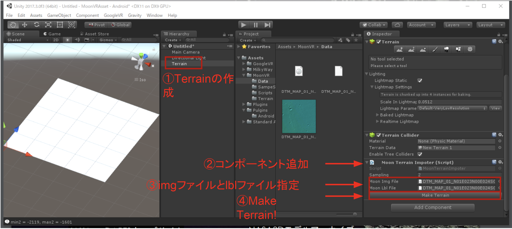
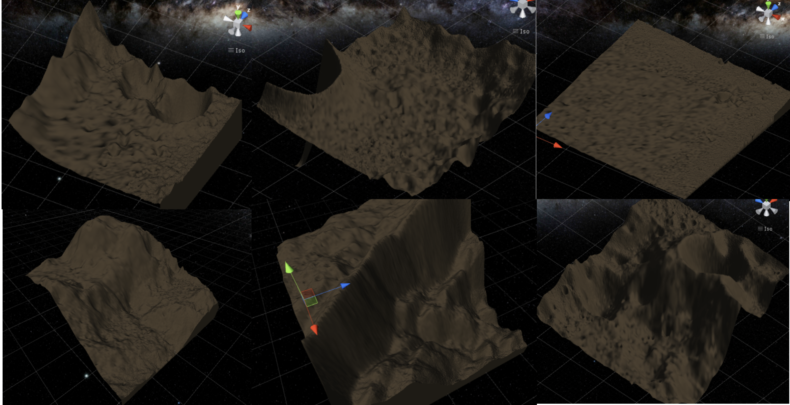
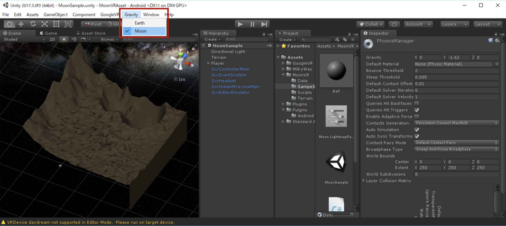
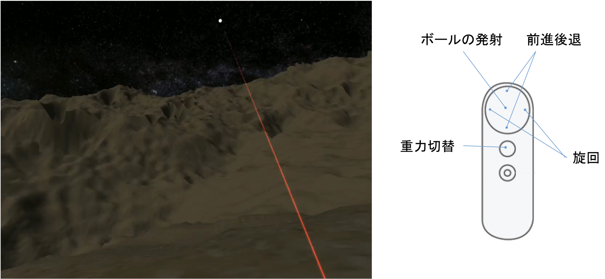

以下の機能を実装したUnityのサンプルプロジェクトです。
1. 月面データをインポートする機能+サンプル5個
1. 地球と月の重力を切り替える機能
1. Daydream用の簡単なサンプルシーン 

## 1. 月面データのインポート機能
事前にPDS準拠データを公開しているサイトからimgファイルとlblファイルをダウンロードする必要があります。

### 月面データのサンプル
サンプルデータはAssets/MoonVR/Terrain以下の置いてあります

## 2. 重力切り替え機能
UnityメニューからPhysics.Gravityを変更できる機能です

## 3. Daydream用の簡単なサンプルシーン

